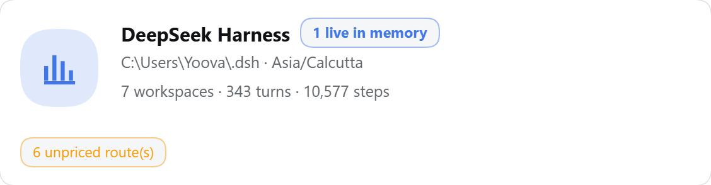
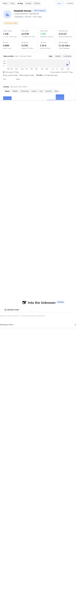
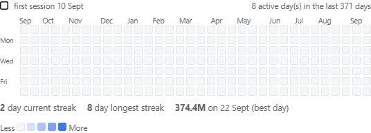
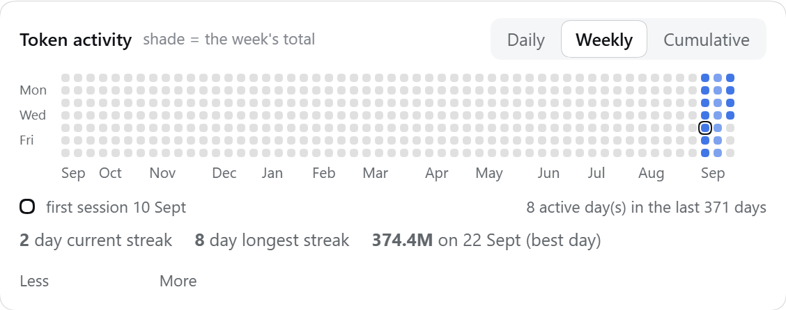
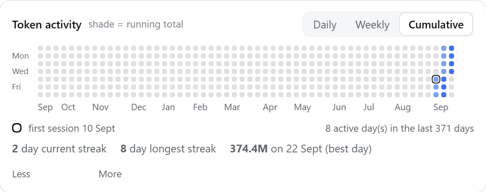
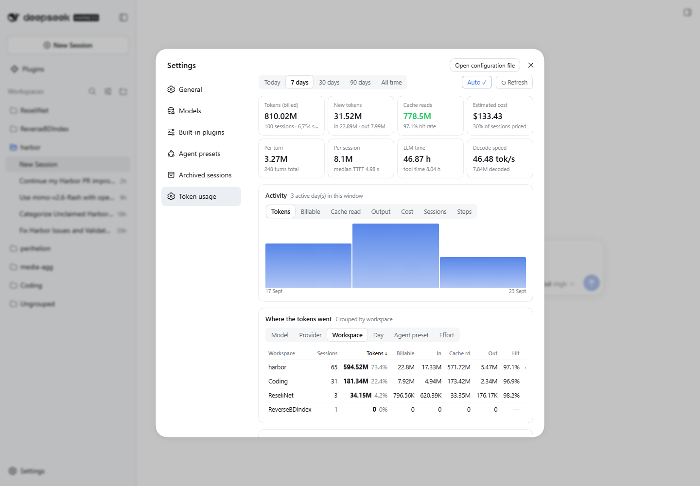
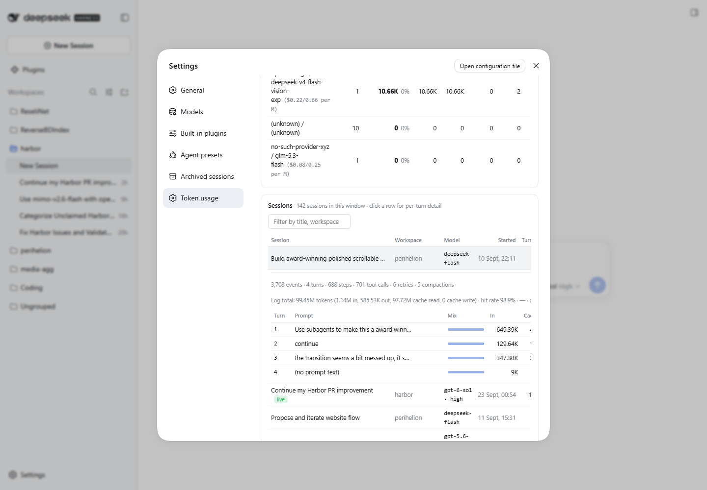
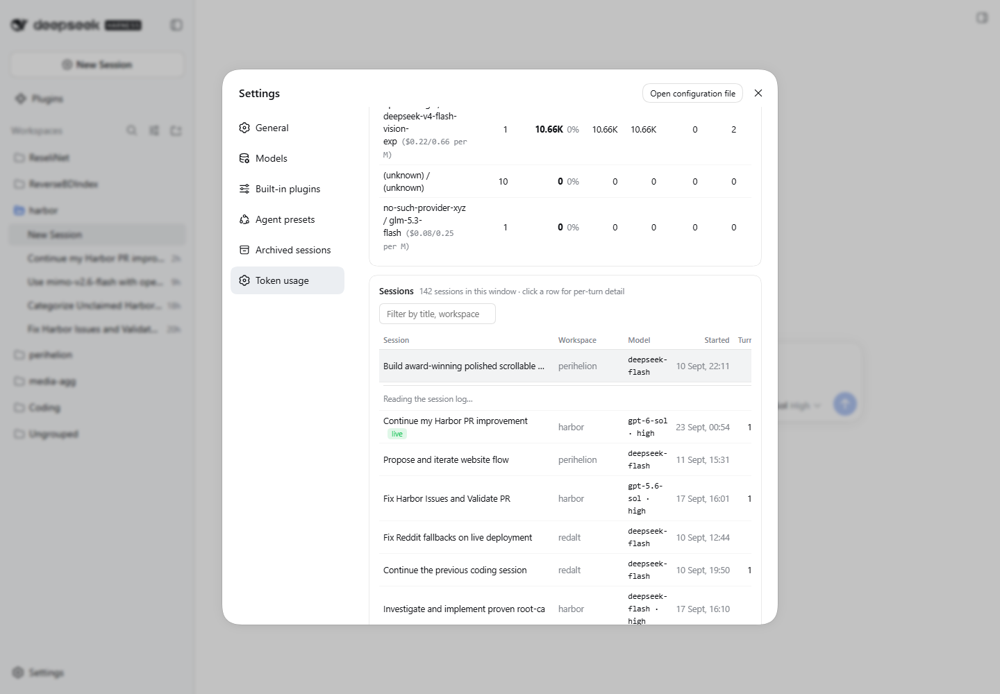
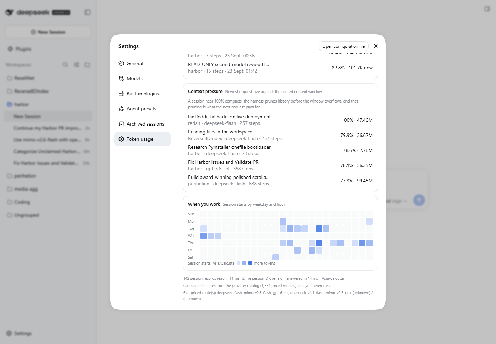

# dsh-token-tracker

**Extensive token and cost accounting for the [DeepSeek Harness](https://www.npmjs.com/package/@deepseek-ai/dsh) — a stat-heavy "Token usage" page inside Settings, built from every session's durable projections, a live-session overlay, and the pi-ai provider catalog.**




*The page opens with a profile header — identity, live-session count, headline stats and badges — followed by the stat tiles, the token activity monitor, and every breakdown table.*

<details>
<summary>Full page (long — the settings pane scrolls)</summary>



</details>

---

## Why

An agent session burns most of its tokens re-reading context it has already paid
for. This plugin makes that visible — per session, per turn, per model, per
workspace — with cache reads broken out, retries and compactions counted,
context pressure measured against the routed window, and a dollar estimate that
says out loud how much of it is actually priced.

Numbers from the author's own harness (142 sessions, six workspaces):

| metric | value |
| --- | --- |
| tokens (billed total) | 1.32 B |
| new tokens (in + out + cache write) | 42.07 M |
| cache reads | 1.27 B |
| cache hit rate | 97.6 % |
| LLM time | 2.39 d |
| estimated cost | $133.67 (29.8 % of sessions priced from the catalog) |

## Features

**Profile header** — a deliberately minimal identity strip: the graph avatar, the
harness identity, home directory and timezone, then one line of counting facts
(workspaces · turns · steps). Every number lives in exactly one place — the
header repeats nothing that a tile or panel below already states.

**Token activity monitor** — a fixed 53-week dot matrix, one circle per day, the
newest day always in the last column and the days before your first session left
blank. Three readings of the same grid, switched from the panel header:

- **Daily** — the day's own tokens.
- **Weekly** — the day's week total, so a column lights as one unit.
- **Cumulative** — the running total through that day, a ramp that shows how the
  year paces.

Cells are sized from the measured pane width, so the matrix fills the settings
pane exactly at any window size instead of scrolling or spilling. Month rail
under the grid, Mon/Wed/Fri row rail, per-day tooltips (tokens · sessions · steps
· cost), the first session ringed and named, a Less→More legend and streak lines
(current, longest, best day). Levels are sqrt-scaled, so one 375M-token day cannot
flatten every other day to the first step; the grid keeps each day on its true
weekday row, so a column never shifts.

**Graph icon on the section's nav row** — the settings shell paints a fallback
gear on every section that declares no icon (the section API takes `id` / `order`
/ `label` only). The tracker tags its own nav row
(`data-dtt-nav="token-usage"`, via a debounced `MutationObserver`) and masks that
row's glyph into a bar-chart mark, so *only* the Token usage row changes — every
other nav row and the sidebar Settings button keep their own icons.

**Overview** — eight KPI tiles (billed tokens, new tokens, cache reads, estimated
cost, per-turn, per-session, LLM time, decode speed) over a selectable window:
today, 7, 30, 90 days, or all time.

**Activity** — a daily chart for any metric (tokens, billable, cache read,
output, cost, sessions, steps) with per-day tooltips.

**Where the tokens went** — a sortable breakdown by model, provider, workspace,
agent preset or reasoning effort: sessions, tokens, billable, in, cache read,
out, hit rate, steps, cost, and each row's share of the window.

**Cache efficiency** — the overall hit rate explained in tokens, plus the sessions
with the *worst* hit rates (5+ steps) — the ones paying full price for the same
context.

**Context pressure** — newest request size against the routed context window, per
session, so you can see what is about to compact.

**When you work** — a weekday × hour heatmap of session starts, in your timezone.

**Sessions** — every session with title, workspace, model, tokens, hit rate, cost
and wall time; filter by title/workspace/model, sort any column, and click a row
for a **per-turn drill-down** read from the durable log: prompt, token-mix bar,
in / cache / out / total, hit rate, cost, steps (retries marked), end reason and
wall clock per turn.

**Honest pricing** — prices come from the pi-ai catalog; anything it cannot price
is reported as `—` and listed by name in the footer instead of being guessed. Add
your own prices in a small JSON file and the cost column fills in.

## Screenshots

| Section icon in the settings nav |
| --- |
|  |

| Profile header | Token activity — daily |
| --- | --- |
|  |  |

| Token activity — weekly | Token activity — cumulative |
| --- | --- |
|  |  |

| Breakdown by workspace | Per-turn drill-down |
| --- | --- |
|  |  |

| Cache and context panels | Weekday × hour heatmap |
| --- | --- |
|  |  |

## Install

This is a dsh *profile plugin*, mounted as a bundle: the profile lists the
package in `dsh.profile.bundles`, the bundle's patch inserts the row, and the
package carries both halves (Host + browser).

```bash
# 1. place the package where the profile resolves it
cd ~/.dsh/profiles/web
mkdir -p plugins node_modules
git clone https://github.com/YoovanP/dsh-token-tracker plugins/dsh-token-tracker
cp -r plugins/dsh-token-tracker node_modules/dsh-token-tracker

# 2. list it as a bundle — profiles/web/package.json:
#      "dependencies": { "dsh-token-tracker": "file:./plugins/dsh-token-tracker" },
#      "dsh": { "profile": { "bundles": [ ... , "dsh-token-tracker" ] } }

# 3. restart the harness — plugin code loads at boot
```

Open the harness UI → **Settings → Token usage**.

> Verified against dsh `0.1.6-alpha.2`: a build whose client module table exposes
> `react` and whose Connection service owns the `/api` browser-trust fence. The
> browser half is a hand-written lazy-CJS bundle — **no build step**.

After editing the source, re-copy the loaded package and restart:

```bash
cd ~/.dsh/profiles/web
cp plugins/dsh-token-tracker/lib/*.js node_modules/dsh-token-tracker/lib/
```

## Configuration

The bundle inserts this row:

```yaml
- insert:
    - id: token-tracker
      name: dsh-token-tracker
```

Add a `config:` block to override defaults:

| key | default | meaning |
| --- | --- | --- |
| `home` | `$DSH_HOME`, else `~/.dsh` | harness home to read |
| `cacheTtlMs` | `4000` | aggregation reuse window for repeated UI reads |
| `detailTtlMs` | `20000` | per-session drill-down reuse window |
| `catalogDir` | auto-resolved | pi-ai provider catalog directory |
| `overridesPath` | `<home>/token-tracker/pricing.json` | price overrides |

## HTTP API

One route, registered on the verified Host Fetch seam
(`ctx.connection.fetch.register`), so it inherits the `/api` browser-trust fence
and the session token:

```
GET /api/token-tracker                  aggregate summary (default: all time)
GET /api/token-tracker?days=30          1 | 7 | 30 | 90, or 0/absent for all time
GET /api/token-tracker?fresh=1          bypass the aggregation reuse window
GET /api/token-tracker?limit=25         cap session rows
GET /api/token-tracker?session=<id>     per-turn drill-down for one session
```

The summary returns `totals`, `byDay`, `byModel`, `byProvider`, `byWorkspace`,
`byPreset`, `byEffort`, `heatmap`, `sessions`, `highlights` (busiest day,
priciest session, thriftiest session, context risk, unpriced routes) and
`sources` (records read, live overlay count, unreadable records, timing).

## Pricing overrides

Custom bridge routes (`opencode-go-v41/deepseek-flash`,
`opencode-go-latest/mimo-v2.6-flash`, `gpt-6-sol`, …) are not in the catalog, so
their sessions report `—` for cost. Add real per-million-token prices to
`<home>/token-tracker/pricing.json`:

```json
{
  "routes": {
    "opencode-go-v41/deepseek-flash": { "input": 0.28, "output": 0.42, "cacheRead": 0.028, "cacheWrite": 0.28 }
  },
  "models": {
    "deepseek-flash": { "input": 0.28, "output": 0.42, "cacheRead": 0.028, "cacheWrite": 0.28 }
  }
}
```

`routes` matches `provider/model` exactly or by prefix (`opencode-go` also covers
`opencode-go-latest`); `models` matches the model name alone. Measured effect: a
33-session repricing lifted cost coverage from 29.6 % to 52.8 %.

## How it works

```
             ┌──────────────────────────────────────────────────────────────────────────────┐
             │ one settings.section page: KPIs · token activity monitor · activity chart ·  │
             │ breakdown · cache · context · heatmap · sessions table · per-turn            │
             │ drill-down (React, no build step)                                            │
             └──────────────────────────────────▲───────────────────────────────────────────┘
                                                │ GET /api/token-tracker (browser-trust fence)
             ┌──────────────────────────────────┴────────── Host half (lib/index.js) ────────┐
             │ scan     storages/session_projcache/sessions/*.json   (durable projections)   │
             │ overlay  ctx.sessions.list() + ctx.sessionProjections.snapshot()  (no lag)    │
             │ detail   ctx.sessionQuery.readSession(id) → fold the event log per turn       │
             │ price    @earendil-works/pi-ai provider catalog + pricing.json overrides      │
             └──────────────────────────────────────────────────────────────────────────────┘
```

Reads go through the sanctioned services rather than scraping files, so the
plugin keeps working when the harness changes how it stores sessions.

## Data semantics (the part that is easy to get wrong)

The durable log's `assistant/message.data.usage` carries an `inputTokens` that is
**already cache-exclusive**: it equals the projection's `uncachedInputTokens`, not
`input + cacheRead`. Subtracting cache reads a second time undercounts billable
input by ~68 % on cache-heavy sessions. This plugin maps:

```
uncachedInputTokens ← usage.inputTokens
outputTokens        ← usage.outputTokens
cacheReadTokens     ← usage.cacheReadTokens
cacheWriteTokens    ← usage.cacheWriteTokens
totalTokens         =  in + out + cacheRead + cacheWrite
billableTokens      =  in + out + cacheWrite     (what a cache-read discount does not cover)
```

A retried attempt replaces the sample it supersedes (`llm/retry-started` closes
the slot), mirroring the harness's own token-meter, so retries are never
double-counted.

## Verification

Measured, not asserted:

* **Projection parity** — per-turn folds of two real logs (3,708 and 16,335
  events) reproduce their durable projections to the token:
  `445,143 / 216,747 / 13,226,304` and `1,135,412 / 585,528 / 97,724,544`.
* **Live API** — `401` without the UI session token, `200` with it; 142 sessions,
  1,315,885,277 tokens, 97.6 % cache hit, live overlay active, 124 ms scan.
* **Drill-down** — a 3,708-event / 12.5 MB log folded to per-turn rows in 1.9 s
  through the live service, rendering prompts, hit rates, retries (`342 (5r)`) and
  end reasons.
* **UI** — mounted headless against the running harness: 8 KPI tiles, 7 panels, 25
  session rows, 175 heatmap cells, window switching, grouping, sorting, filtering
  and drill-down, with no console or page errors.
* **Token activity monitor** — 378 dots (54 weeks × 7), exactly 371 of them
  carrying a day, and every one of those on its true weekday row (0 mismatches).
  The three readings reconcile with the route payload: 8 lit days daily, 18
  weekly (three uniform columns, no mixed levels), 14 cumulative (a
  non-decreasing ramp ending at 1.32 B through today). Cells measured 6 px with a
  3 px gap filling a 536 px settings pane with zero overflow; the weekday rail
  and month labels align to the grid at 0 px drift in both themes.

## Limitations

* Sessions that have not routed a request yet contribute no model attribution.
* Compaction cost appears as its effect on the next request, not as a line item.
* Cost is an estimate (catalog prices × measured buckets), not invoiced spend.
* Table rows are mouse-driven, matching the harness's own sections.

## License

MIT © YoovanP
